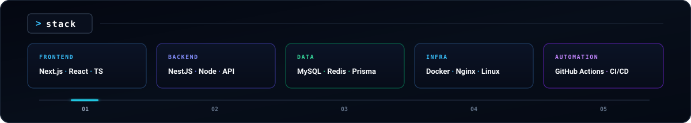

  <!-- Hero Banner: Cosmic Orbital System & Matrix Digital Rain (SMIL Animated) -->
  

    

  <!-- Core Slogan (Monospace Cyan Typography) -->
  <h3><code>Build clean. Ship fast. Automate.</code></h3>

   

  <!-- Cyber Navigation & Metric Badges -->
  

    
    &nbsp;&nbsp;
    
    &nbsp;&nbsp;
    
  

  <!-- Cyber Matrix Rain Divider (SMIL Animated - Continuous Waterfall) -->
  

    

  <!-- Architecture Overview Cards (Top Half) -->
  

    

  <!-- 16 Tech Stack Grid (Configurable HTML in README - Powered by External API) -->
  <table>
    <tr>
      <td align="center" width="100">
         
        <b>TypeScript</b>
      </td>
      <td align="center" width="100">
         
        <b>JavaScript</b>
      </td>
      <td align="center" width="100">
         
        <b>PM2</b>
      </td>
      <td align="center" width="100">
         
        <b>React</b>
      </td>
      <td align="center" width="100">
         
        <b>Next.js</b>
      </td>
      <td align="center" width="100">
         
        <b>Node.js</b>
      </td>
      <td align="center" width="100">
         
        <b>NestJS</b>
      </td>
      <td align="center" width="100">
         
        <b>Prisma</b>
      </td>
    </tr>
    <tr>
      <td align="center" width="100">
         
        <b>MySQL</b>
      </td>
      <td align="center" width="100">
         
        <b>PostgreSQL</b>
      </td>
      <td align="center" width="100">
         
        <b>Redis</b>
      </td>
      <td align="center" width="100">
         
        <b>Docker</b>
      </td>
      <td align="center" width="100">
         
        <b>Nginx</b>
      </td>
      <td align="center" width="100">
         
        <b>Linux</b>
      </td>
      <td align="center" width="100">
         
        <b>Actions</b>
      </td>
      <td align="center" width="100">
         
        <b>Git</b>
      </td>
    </tr>
  </table>

    

  <!-- Cyber Matrix Rain Divider -->
  

    

  <!-- Matrix Digital Rain Stream & Realtime Diagnostic Console -->
  

    

  <!-- Cyber Matrix Rain Divider -->
  

    

  <!-- Contribution Streak & Activity Telemetry -->
  

    <code>[ GITHUB.TELEMETRY // CONTRIBUTION_STREAK ]</code>
  

  

    
  

  

    
    &nbsp;&nbsp;
    
  

   

  <!-- Contribution Snake Graph (Auto-updates via Cron Workflow) -->
  

    

  <!-- Cyber Matrix Rain Divider -->
  

   

  <!-- Terminal System Telemetry Footer -->
  

    <code>&gt;_ NODE: imaira203 // ARCH: SYSTEM BUILDER // PIPELINE: ACTIVE // STATUS: OPEN FOR COLLABORATION</code>
  

